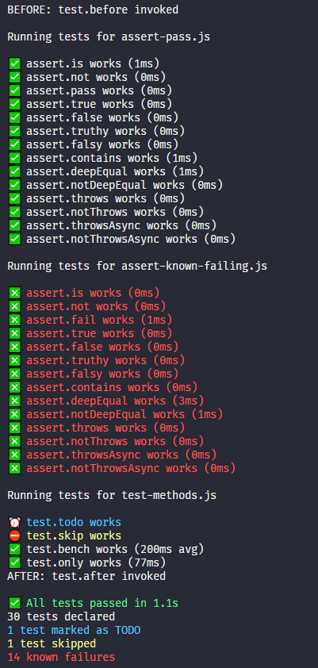

# mvt [](https://npmjs.org/package/mvt)   [](https://github.com/feross/standard)   

> Minimum Viable Testing framework, it's like AVA, if AVA sucked

## You should probably use AVA
Because [AVA](https://github.com/avajs/ava) is awesome.

## What is this
It started as a few test helpers. I made it for small projects with minimal
test needs. That was a bit too restrictive though. In version `4.0.0+` it became
a blatant ripoff of AVA. Well, not really. It does about 1% of what AVA does,
and it doesn't do that nearly as well.

## If it's inferior in every way to AVA then why does it exist
Because I need to minimize my security alerts so that I don't lose real security
threats in the deluge. I'm often finding my devDependencies to be the culprit
of most alerts. This is an effort to minimize recursive devDependencies.

## What's good about it
- It has 0 dependencies and devDependencies
- That's really about it

## What it lacks (way more than I can list, but here's the most notable)
- A CLI (for now)
  - tests must be run as `node tests/a.js`
  - the above must be done for each test file `node tests/a.js && node tests/b.js`
  - thus each test file gets a distinct output, so no central tracking of tests
- Useful `Error` output
  - you won't get a clean stack, it will be filled with useless info from `mvt`
  - that will make it difficult to debug where problems actually occurred
- Concurrency
  - that's not a thing here
- Transpilation
  - also not a thing here
- A community and product maturity
  - one of the most crucial pieces, I think we can all agree on that

## This might be for you if
- You're willing to sacrifice all of the above (and more) to reduce dependencies
- Your tests are in a single file and concurrency doesn't impact test times

## Install

```sh
$ npm install --save-dev mvt
```

## Usage

```js
const test = require('mvt')

test.setup({ verbose: true })

test.after(() => console.log('test.after invoked'))

test.before(() => console.log('test.before invoked'))

test('assert.is works', (assert) => assert.is(1, 1))

test('assert.not works', (assert) => assert.not(1, 2))

test('assert.pass works', assert) => assert.pass())

test.failing('test.failing and assert.fail works', (assert) => assert.fail())

test('assert.truthy works', (assert) => assert.truthy(1))

test('assert.falsy works', (assert) => assert.falsy(0))

test('assert.deepEqual works', (assert) => assert.deepEqual([1, 2], [1, 2]))

test('assert.throws works', (assert) => {
  assert.throws(() => { throw new Error('it throws') })
})

test('assert.notThrows works', async (assert) => {
  assert.notThrows(() => {})
})

test('assert.throwsAsync works', async (assert) => {
  await assert.throwsAsync(() => new Promise((resolve, reject) => {
    process.nextTick(() => reject(new Error('rejected Promise')))
  }))
})

test('assert.notThrowsAsync works', async (assert) => {
  await assert.notThrowsAsync(() => new Promise((resolve, reject) => {
    process.nextTick(() => resolve('all good'))
  }))
})

test.todo('test.todo works')

test.skip('test.skip works', (assert) => assert.truthy('skipped'))

test.only('test.only works', (assert) => assert.truthy('only'))

test.bench('test.bench works', { samples: 5, max: 300 }, (assert) => {
  return new Promise((resolve, reject) => {
    setTimeout(() => resolve(), 200)
  })
})
```



## API

Right now I'm feeling lazy. The full API is documented under `usage`. Eventually
I'll add it here. You can also check the test file, though it's about the same
as usage.

## Notes

If your test file is called with the `--verbose` flag it will list all passed tests

It fails fast and hard with `process.exit(1)`

## License

MIT © [Andrew Carpenter](https://github.com/doesdev)
